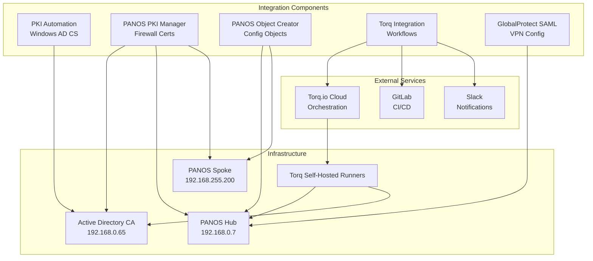
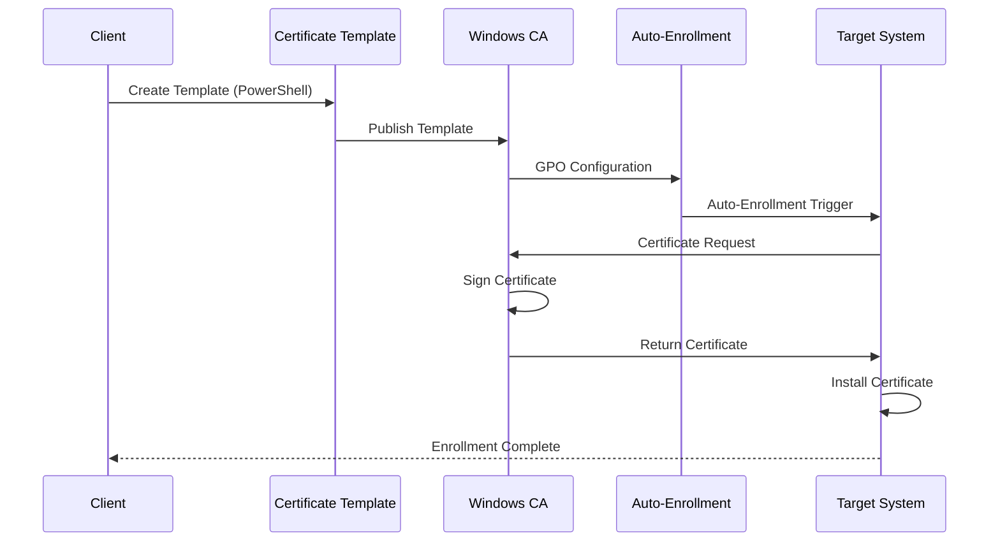
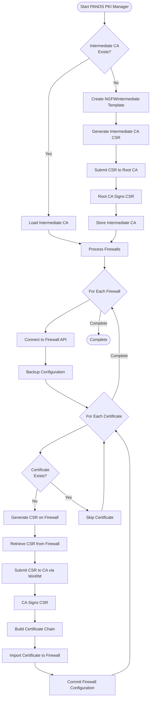
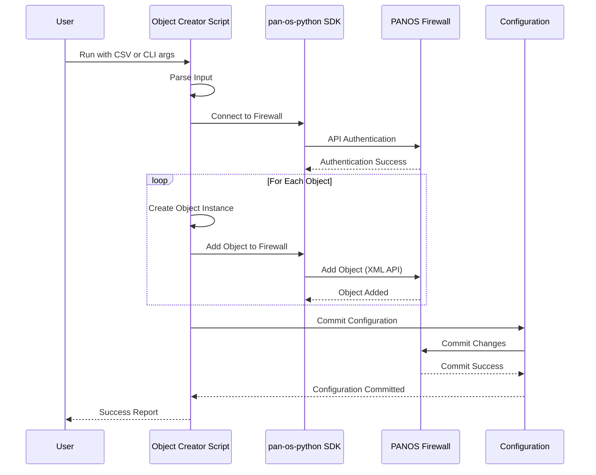
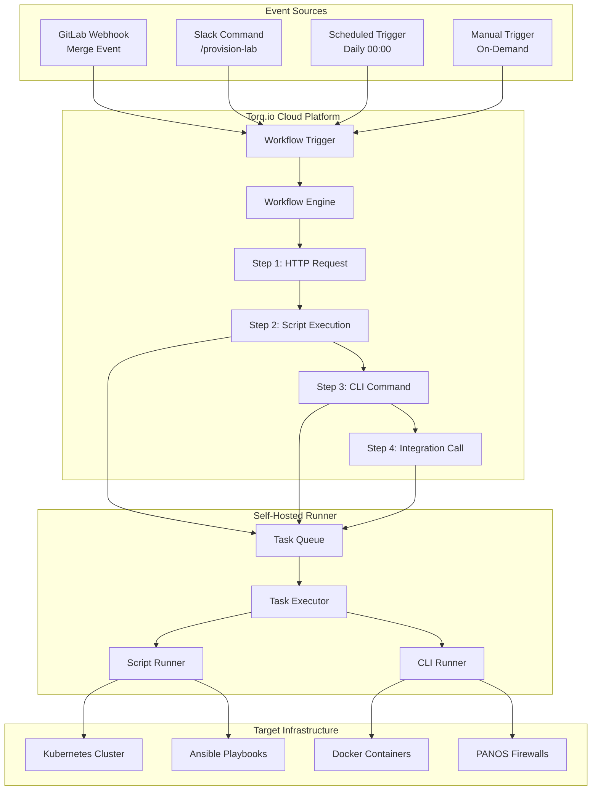
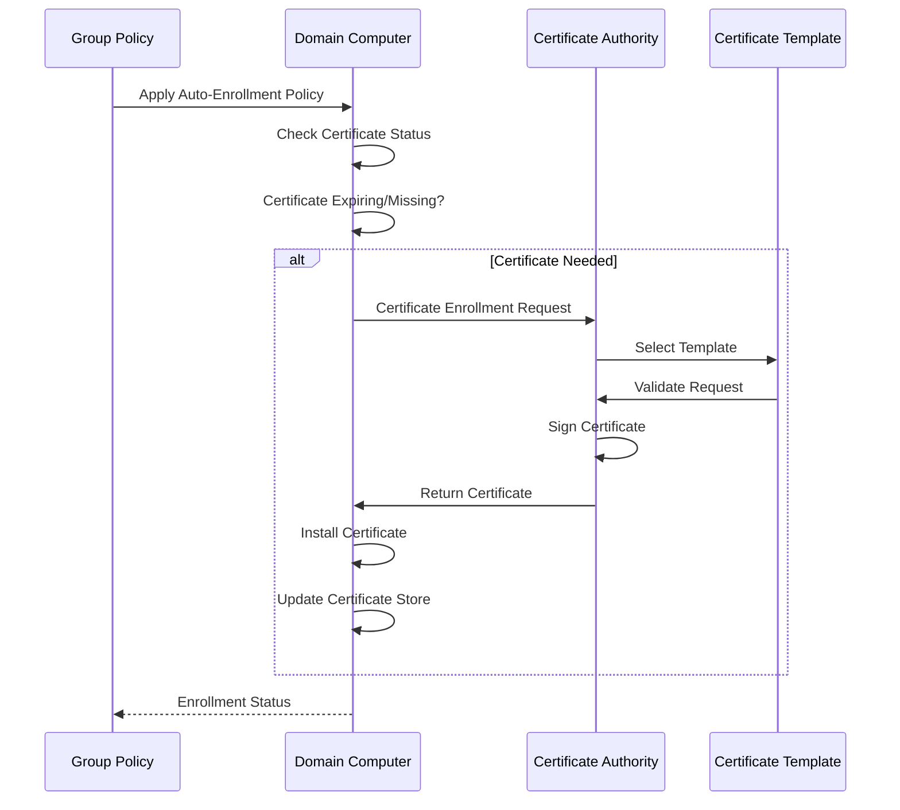
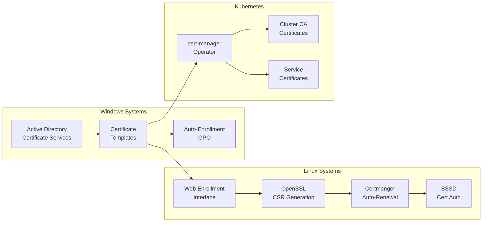
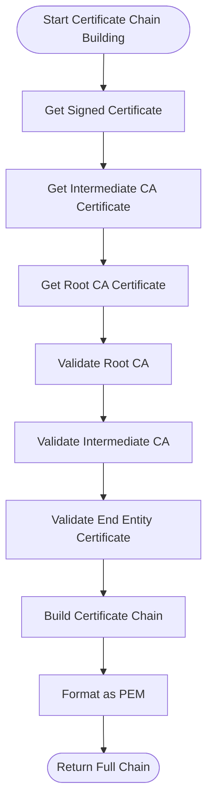
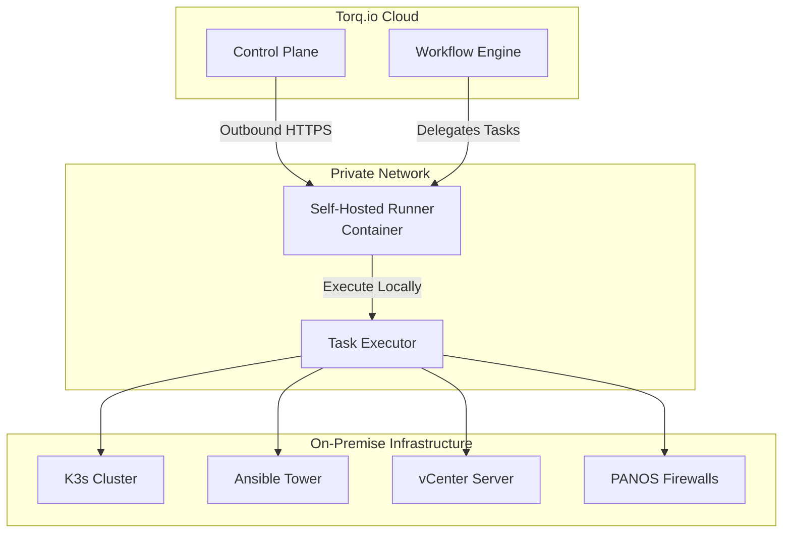
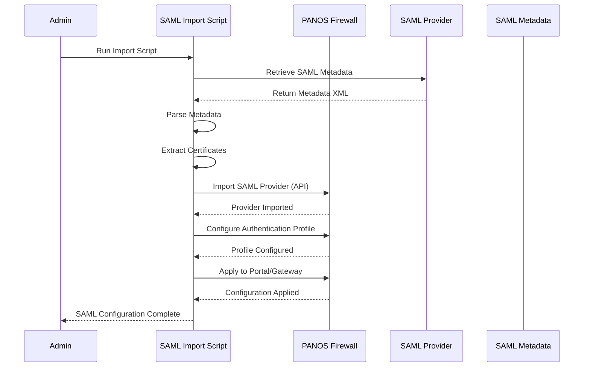

# Baker Street Integrations Design Diagrams

All design maps and diagrams for integration infrastructure, rendered in Mermaid format.

---

## Integration Architecture Overview

---

## PKI Certificate Lifecycle Flow

---

## PANOS PKI Manager Workflow

---

## PANOS Object Creator Workflow

---

## Torq Workflow Orchestration Flow

---

## Certificate Auto-Enrollment Flow

---

## PKI Cross-Platform Integration

---

## PANOS Certificate Chain Building

---

## Torq Self-Hosted Runner Architecture

---

## GlobalProtect SAML Configuration Flow

---

**Last Updated**: 2026-01-08  
**Maintained By**: Baker Street Labs Infrastructure Team

